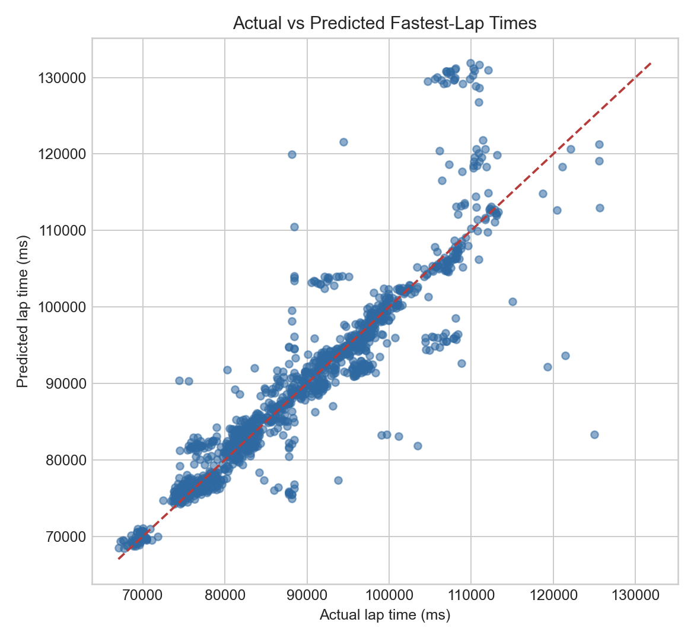

<div align="center">
  
# 🏎️ F1 Predictive Modeling & Data Analysis

[](https://www.python.org)
[](https://scikit-learn.org)
[](https://xgboost.readthedocs.io)
[](https://lightgbm.readthedocs.io)

*A collaborative, comprehensive machine learning pipeline designed to forecast Formula 1 race outcomes using historical data.*

---
</div>

## 🚀 Overview & Features

This project utilizes decades of historical race data to engineer complex features, predict **Top 3 podium finishes** (Classification), and forecast the **fastest lap times** (Regression). 

- 🧹 **Data Merging & Cleaning**: Robust data leakage prevention, strict NaN management, and intelligent joining of multiple F1 relational datasets.
- ⚙️ **Advanced Feature Engineering**: Extracts dynamic contextual features like rolling form averages, win streaks, circuit dominance, qualifying deltas, and pit stop strategies.
- 🏆 **Podium Prediction (Classification)**: XGBoost and LightGBM models predict whether a driver will finish in the Top 3.
- ⏱️ **Fastest Lap Prediction (Regression)**: Random Forest and LightGBM models forecast the personal best lap time for each driver.
- 📊 **Interpretability**: Integrates feature importance metrics and SHAP analysis for highly transparent ML predictions.

---

## 📈 Model Performance & Results

Our models were rigorously tested against recent racing seasons (2022-2024 test split). Here are the highlights of our predictive performance:

### 🏆 Classification: Podium Prediction (Top 3)
We utilize **LightGBM** and **XGBoost** to classify if a driver will secure a podium finish.

| Metric | Score | Description |
| :--- | :---: | :--- |
| **ROC-AUC** | `0.916` | High capability in distinguishing podium vs non-podium drivers. |
| **F1-Score** | `0.606` | Harmonic mean of precision and recall. |
| **Precision@3**| `0.598` | Accuracy when focusing strictly on our top 3 predicted drivers. |

### ⏱️ Regression: Fastest Lap Time Prediction
We target the `personal_best_lap_ms` using an offset strategy against the qualifying time. **LightGBM** emerged as the superior model.

| Model | MAE (ms) | RMSE (ms) | R² Score |
| :--- | :---: | :---: | :---: |
| Global Median Baseline | 9,465 | 11,321 | -0.018 |
| Circuit Median Baseline | 3,461 | 5,671 | 0.744 |
| **Random Forest** | 2,809 | 5,372 | 0.770 |
| **LightGBM (Best)** | **2,601** | **5,092** | **0.793** |

*On average, our LightGBM model predicts a driver's fastest lap time with an error of just ~2.6 seconds (2601 ms), heavily outperforming naive baselines.*

#### Visualizing the Regression Results

<details open>
<summary><b>Click to view Model Comparisons & Residuals</b></summary>
<br>
<p align="center">
  
  
</p>
</details>

---

## 📁 Project Structure

```text
.
├── data/
│   ├── df_master.parquet            # Merged and cleaned master dataset
│   ├── df_train_ready.parquet       # Scaled data ready for ML training
│   └── ...                          # JSON metrics and Joblib model outputs
├── docs/
│   ├── stage1_report.txt            # Stage 1: Data prep reports
│   ├── classification_guide_tr.md   # Podium classification guide
│   ├── regression_report.md         # Fastest lap regression analysis
│   └── *.png                        # Output plots and visualizations
├── src/
│   ├── features/
│   │   ├── feature_engineering.ipynb# EDA & Feature exploration
│   │   └── preprocessing.py         # Automated ETL scripts
│   └── models/
│       ├── classification_podium.py # Classification ML training
│       └── regression_fastest_lap.py# Regression ML training
├── requirements.txt                 # Project dependencies
└── README.md                        # You are here!
```

---

## 🛠️ Installation & Setup

1. **Clone the repository** and navigate to the root directory.
2. **Create and Activate a Virtual Environment:**
   ```bash
   python -m venv .venv
   # Windows:
   .\.venv\Scripts\activate
   # Mac/Linux:
   source .venv/bin/activate
   ```
3. **Install Dependencies:**
   ```bash
   pip install -r requirements.txt
   ```

---

## 💻 Usage & Pipeline Execution

Execute the modular pipeline directly from the root directory:

**1. Data Preprocessing & Feature Engineering**
```bash
python src/features/preprocessing.py
```

**2. Train Podium Classification Model**
```bash
python src/models/classification_podium.py
```

**3. Train Fastest Lap Regression Model**
```bash
python src/models/regression_fastest_lap.py
```

---
<div align="center">
  <i>Developed by Ahsen and Team.</i>
</div>
