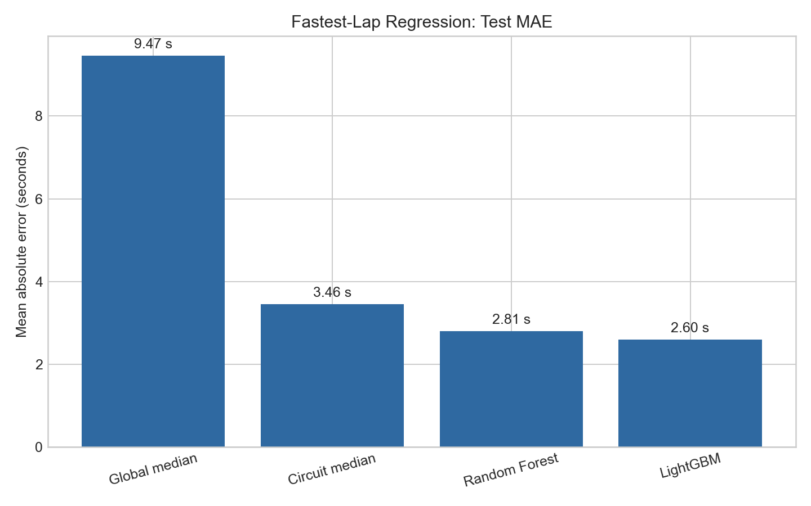
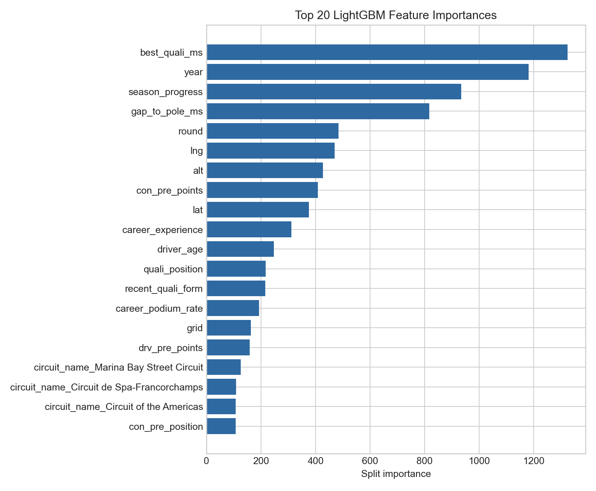

# Fastest-Lap Regression Report

## 1. Objective

The objective is to predict each Formula 1 driver's personal fastest race lap,
stored in `personal_best_lap_ms`. The prediction moment is explicitly defined
as **after qualifying and before the race starts**.

The output is one predicted lap time per driver-race observation, expressed in
milliseconds. For example, a prediction of `89,500 ms` corresponds to a lap of
`1:29.500`.

## 2. Dataset and Chronological Split

The prepared dataset contains 8,970 driver-race observations from 2003 through
2024. A random split was avoided because it would mix past and future seasons
and produce an unrealistically easy evaluation.

| Dataset | Seasons | Rows |
|---|---:|---:|
| Training | 2003-2018 | 6,411 |
| Validation | 2019-2021 | 1,200 |
| Test | 2022-2024 | 1,359 |

Model and hyperparameter selection used validation MAE only. The test period
was kept untouched until final evaluation.

## 3. Leakage Prevention

The following columns were excluded because they are only known during or
after the race:

- `gap_to_fastest_ms`
- `is_podium`
- `pit_stop_count`
- `avg_pit_dur_ms`

Using these fields would allow the model to access information from the event
it is supposed to predict.

Numeric identifiers (`raceId`, `driverId`, `constructorId`, and `circuitId`)
were also removed. Driver, constructor, and circuit names were retained and
encoded with one-hot encoding.

## 4. Target Formulation

Circuits have substantially different lap lengths. Instead of directly
learning absolute lap time, each model learns the difference between the
driver's race fastest lap and best qualifying lap:

```text
lap_residual_ms = personal_best_lap_ms - best_quali_ms
```

The final output is reconstructed as:

```text
predicted_lap_ms = best_quali_ms + predicted_lap_residual_ms
```

This formulation normalizes much of the circuit-length effect while preserving
the required fastest-lap output.

Weather and track-condition variables are absent from the dataset. Therefore,
only the **training residual targets** are clipped at their 1st and 99th
percentiles to prevent isolated, unmodelled events from dominating later
predictions. Validation and test targets are never clipped.

## 5. Models

Four approaches were compared:

- Global historical median
- Circuit-specific historical median
- Random Forest Regressor
- LightGBM Regressor

Three LightGBM configurations were evaluated. The best validation configuration
used 700 estimators, a learning rate of 0.025, 15 leaves, a minimum of 30 child
samples, and L2 regularization of 2.0.

## 6. Evaluation Metrics

- **MAE:** Average absolute prediction error. This is the primary selection
  metric and is easy to interpret in seconds.
- **RMSE:** Gives greater weight to large prediction errors.
- **R-squared:** Fraction of target variance explained by the model.

## 7. Final Test Results

| Model | MAE (ms) | RMSE (ms) | R-squared |
|---|---:|---:|---:|
| Global median | 9,465.0 | 11,321.9 | -0.019 |
| Circuit median | 3,461.3 | 5,671.5 | 0.744 |
| Random Forest | 2,809.2 | 5,372.3 | 0.771 |
| **LightGBM** | **2,601.8** | **5,092.3** | **0.794** |

LightGBM achieved an average absolute error of approximately **2.60 seconds**
and explained approximately **79.4%** of the variance in the 2022-2024 test
period.

### LightGBM Results by Season

| Season | MAE (ms) | RMSE (ms) | R-squared |
|---|---:|---:|---:|
| 2022 | 2,650.9 | 4,492.0 | 0.870 |
| 2023 | 2,641.9 | 5,334.6 | 0.761 |
| 2024 | 2,519.8 | 5,375.6 | 0.719 |

MAE remains between 2.52 and 2.65 seconds in all three test seasons, indicating
that the aggregate result is not driven by a single season.



## 8. Feature Interpretation

The strongest LightGBM features include:

- `best_quali_ms`
- `year`
- `season_progress`
- `gap_to_pole_ms`
- `round`
- circuit location and altitude
- constructor pre-race points
- career experience
- recent qualifying form

The result indicates that fastest-lap performance is driven primarily by
qualifying pace and circuit context, followed by season context and current
driver or constructor performance.

Feature importance describes model usage, not causality. Correlated variables
may divide importance between themselves.



## 9. Error Analysis and Limitations

Half of the test predictions have an absolute error below approximately 1.14
seconds. The largest errors occur in unusual races involving incidents,
technical problems, rain, or abnormal lap conditions.

Important missing predictors include:

- rainfall and track temperature
- tire compound and tire age
- safety-car and red-flag periods
- fuel load
- detailed weather and track status

Adding these variables should reduce large errors, particularly RMSE.

The preprocessing report states that missing values were filled. Missing
**target** values must never be imputed. If `personal_best_lap_ms` was missing
in the raw data, that row should be excluded from regression training rather
than assigned an artificial target. This should be confirmed in the upstream
data-preparation code.

## 10. Reproduction

From the repository root:

```bash
pip install -r requirements.txt
pip install -r src/models/regression_requirements.txt
python src/models/regression_fastest_lap.py
```

The script produces:

- `data/regression_metrics.json`
- `data/regression_metrics_by_year.csv`
- `data/regression_test_predictions.csv`
- `data/regression_feature_importance.csv`
- `data/regression_fastest_lap_model.joblib`
- `docs/regression_model_comparison.png`
- `docs/regression_actual_vs_predicted.png`
- `docs/regression_residuals.png`
- `docs/regression_feature_importance.png`
